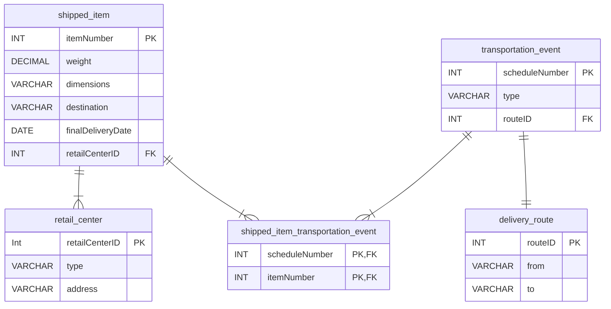
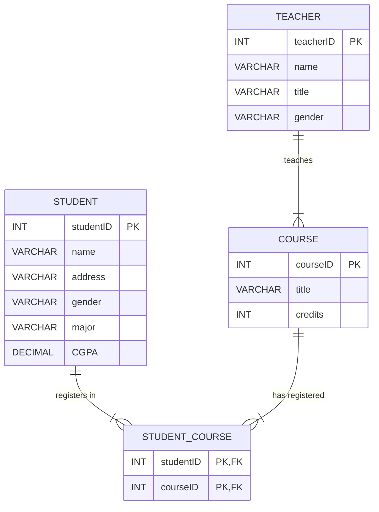

# Task 1: 
## Description 
TCS provides up-to-date information on the processing and current location of each shipped item. To do this, TCS relies on a company-wide information system in which shipped items are characterized by unique itemNumber, weight, dimensions, destination, and finalDeliveryDate. Shipped items are received into the TCS system at a retail center. Retail centers are characterized by their type, uniqueID, and address. Shipped items make their way to destination via one or more standard TCS transportation events (i.e., flights, truck deliveries). These transportation events are characterized by a unique scheduleNumber, a type (e.g, flight, truck), and a deliveryRoute. Create an Entity 
## Deliverable
Relationship diagram that captures this information about the TCS system and then convert it to the corresponding Relational Model. 

## ER Diagram

## Relational Model
### 1. shipped_item
#### Attributes:
- itemNumber (INT, Primary Key)
- weight (DECIMAL)
- dimensions (VARCHAR)
- destination (VARCHAR)
- finalDeliveryDate (DATE)
- retailCenterID (INT, Foreign Key referencing retail_center.retailCenterID)
### 2. retail_center
#### Attributes:
- retailCenterID (INT, Primary Key)
- type (VARCHAR)
- address (VARCHAR)
**Note:** Each shipped_item is linked to one retail_center (one-to-many relationship).
### 3. transportation_event
#### Attributes:
- scheduleNumber (INT, Primary Key)
- type (VARCHAR)
- routeID (INT, Foreign Key referencing delivery_route.routeID)
**Note:** The relationship between transportation_event and delivery_route is one-to-one (each event has one route, and each route is associated with one event).
### 4. delivery_route
#### Attributes:
- routeID (INT, Primary Key)
- from (VARCHAR)
- to (VARCHAR)
### 5. shipped_item_transportation_event
#### Attributes:
- scheduleNumber (INT, Part of Composite Primary Key, Foreign Key referencing transportation_event.scheduleNumber)
- itemNumber (INT, Part of Composite Primary Key, Foreign Key referencing shipped_item.itemNumber)
**Note:** This is an associative (junction) table representing the many-to-many relationship between shipped_item and transportation_event.

 

# Task 2:
## Description
A college’s database is to be designed in which: 
- We have students; each student has a unique ID, name, address, gender, major, and CGPA
- We have courses, each course has a unique courseID, title, and credits 
- We have teachers; each teacher has a unique teacherID, name, title, and gender
- Teachers teach the courses and Students register in courses. 
## Deliverable
Create an Entity Relationship diagram that captures this information about the college and then convert it to the corresponding Relational Model. 
## ER Diagram

## Relational Model
### 1. STUDENT
#### Attributes:
- studentID (INT, Primary Key)
- name (VARCHAR)
- address (VARCHAR)
- gender (VARCHAR)
- major (VARCHAR)
- CGPA (DECIMAL)
### 2. TEACHER
#### Attributes:
- teacherID (INT, Primary Key)
- name (VARCHAR)
- title (VARCHAR)
- gender (VARCHAR)
### 3. COURSE
#### Attributes:
- courseID (INT, Primary Key)
- title (VARCHAR)
- credits (INT)
- teacherID (INT, Foreign Key referencing TEACHER.teacherID)
**Note:** This foreign key implies that each course is taught by one teacher.
### 4. STUDENT_COURSE
#### Attributes:
- studentID (INT, Part of Composite Primary Key, Foreign Key referencing STUDENT.studentID)
- courseID (INT, Part of Composite Primary Key, Foreign Key referencing COURSE.courseID)
**Note:** This associative table captures the many-to-many relationship between students and courses, where a student can register for many courses and a course can have many students.
