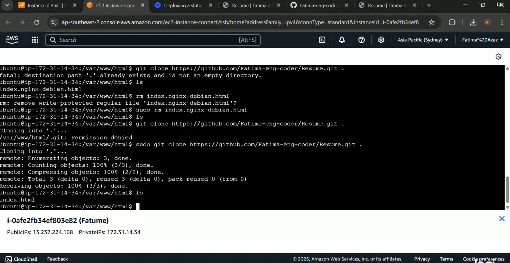

# 1. Introduction

## 1.1 Objective
This guide explains how to deploy an HTML-based CV page using AWS EC2, showcasing cloud computing via the Infrastructure as a Service (IaaS) model. It provides clear, step-by-step instructions for launching an Ubuntu-based EC2 instance, configuring security settings, installing a web server, and deploying your CV page.

## 1.2 AWS and IaaS Overview
Amazon Web Services (AWS) is a leading public cloud platform offering flexible and scalable solutions. The IaaS model allows users to manage virtualized computing resources without investing in physical hardware, making it ideal for dynamic web hosting and application deployment.

# 2. Prerequisites

- AWS account
- Already made HTML CV
  
# 3. Step by step guide
1. Signin into your AWS Account.
2. Go to AWS Console
    
3. Go to EC2 if in recently visited. if have new account search EC2 in the search bar.
4. Go to EC2 Dashboard 
    
5. Go to EC2 instances and then lauch instance 
### EC2 Instance:

Launch an EC2 instance with Ubuntu 22.04. Make a note of the instance's public IP or DNS.
    

### Creating Key pairs:
Create or use an existing SSH key pair to connect to the EC2 instance.
    

6. Then configured Security Group
### Configure Security Group:

Configure the security group to allow traffic on ports 80 (HTTP) and 22 (SSH).
In Netwrk setting, allow both SSH traffic and  allow HTTP tarffic so that our html webpage could be accessible.
    

7. Connect to Ubuntu EC2 instance 
    
    

8. ### Install Nginx:
I've installed Nginx on AWS using sudo apt update && sudo apt install nginx, we can also use alternatives like Apache, Caddy, or LiteSpeed.
    

9. ### Starting Nginx:
We can Nginx on AWS with sudo systemctl start nginx, and enable it to run on boot using sudo systemctl enable nginx. Verify it's running with sudo systemctl status nginx.
    
    

10. Cloning Github Repositry to deploy on Amazon Web Services:
    
    

## URL of HTML Resume
I have successfully deployed my resume on AWS, you can access it at the following URL:"
http://13.237.224.168/